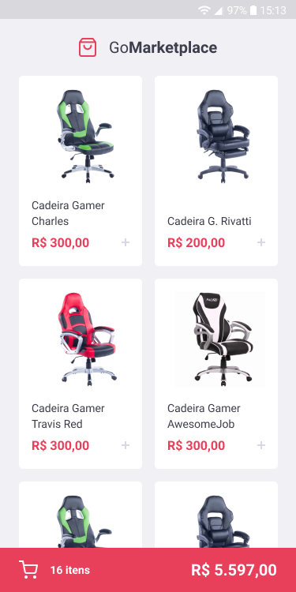
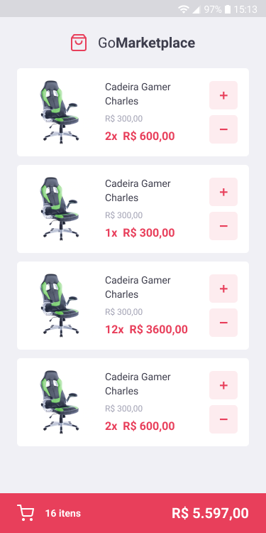

<h1 align="center">

</h1>

<p align="center">A marketplace application where you can view the products for sale, their price and the shopping cart with the total products and the total price.</p>

<p align="center" color="">
  

  

  <a href="https://github.com/pjavier98/gomarketplace/commits/master">
    
  </a>

  <a href="http://makeapullrequest.com">
    
  </a>

  <a href="https://opensource.org/licenses/MIT">
    
  </a>
</p>

<hr />
<div style="display: flex; flex-direction: row; align-items: center; justify-content: center">
  
  
</div>

## Features

This app features all the latest tools and practices in web development!

- [React Native](https://reactnative.dev/)
- [TypeScript](https://www.typescriptlang.org/)
- [JSON Server](https://github.com/typicode/json-server)
- [Styled Components](https://styled-components.com/)
- [React Navigation](https://reactnavigation.org/)
- [Async Storage](https://github.com/react-native-community/async-storage)
- [Axios](https://github.com/axios/axios)
- [React Native Vector Icons](https://github.com/oblador/react-native-vector-icons)
- [Jest](https://jestjs.io/)

**Lint:**
- [Eslint](https://eslint.org/)
- [Prettier](https://prettier.io/)
- [EditorConfig](https://editorconfig.org/)

## Getting started

### Requirements
* Node.js
* Yarn
* Emulator from Android or iOS

**Clone this repo using:**
```
$ git clone https://github.com/pjavier98/gomarketplace.git
```
**Move to the appropriate directory:**
```
$ cd gomarketplace

# Install the dependencies
$ yarn

# Run the JSON Server
$  yarn json-server server.json -p 3333

# Inicialize the emulator or connect a Android or iPhone

# If connect a cell phone run
$ adb devices
$ adb reverse tcp:3030 tcp:3030

# To run the React Native
$ npx react-native run-android
$ npx react-native start
```
## Contributing

Please read [CONTRIBUTING.md](CONTRIBUTING.md) for details on our code of conduct, and the process for submitting pull requests.

## License

This project is licensed under the MIT License - see the [LICENSE.md](LICENSE.md) file for details.
